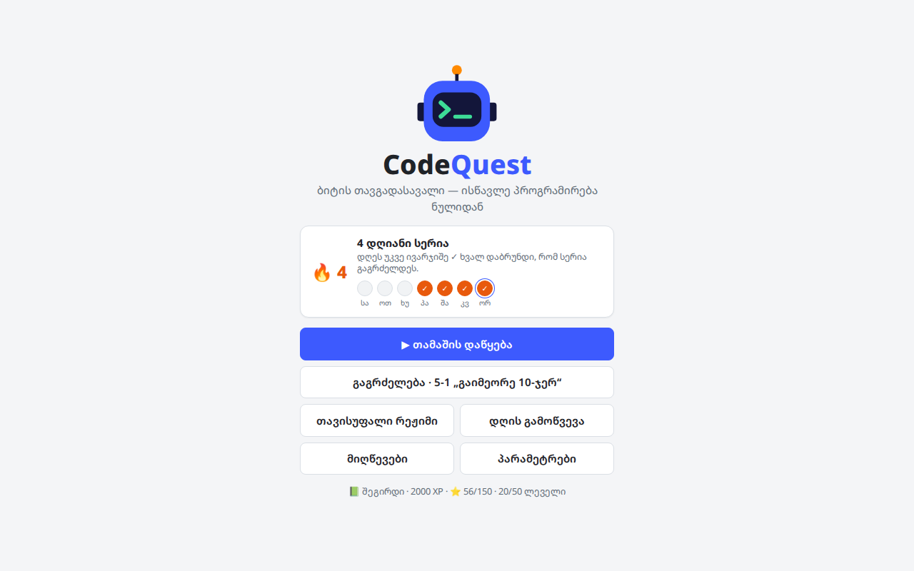

# CodeQuest: ბიტის თავგადასავალი

სასწავლო თამაში, რომელიც JavaScript-ს ნულიდან გასწავლის. რობოტ ბიტს კოდით მართავ: წერ ბრძანებებს, უშვებ და უყურებ, როგორ ასრულებს მათ ბიტი რუკაზე. თამაში მთლიანად ქართულადაა, შეცდომების ახსნის ჩათვლით.

### ▶ [ითამაშე ბრაუზერში](https://lazarepataraia910-jpg.github.io/fanycod/)

> ბმული იმუშავებს მას შემდეგ, რაც რეპოში GitHub Pages ჩაირთვება (იხ. [GitHub Pages-ზე გამოქვეყნება](#github-pages-ზე-გამოქვეყნება)).

## რას ისწავლი

| # | სამყარო | თემა |
|---|---------|------|
| 1 | 🌱 მწვანე ველი | პირველი ნაბიჯები |
| 2 | 🌲 რიცხვების ტყე | ცვლადები |
| 3 | ⛰️ კალკულატორის მთა | ოპერატორები |
| 4 | 🚦 გზაჯვარედინის ქალაქი | პირობები |
| 5 | 🌊 მარადიული მდინარე | ციკლები |
| 6 | 🔧 ხელოსნის სახელოსნო | ფუნქციები |
| 7 | 📦 საწყობის ქვესკნელი | მასივები |
| 8 | 🏙️ ობიექტების ქალაქი | ობიექტები |
| 9 | 🗼 ალგორითმების კოშკი | ალგორითმები |
| 10 | 🏰 გლიჩის ციხე | საბოლოო გამოცდა |

თითოეულ სამყაროში 5 ლეველია: სამი ახალ თემაზე, ერთი სავარჯიშო და ბოსი. სულ 50 ლეველია, ბოლო ბოსს (გლიჩს) კი 3 ფაზა აქვს.

## შესაძლებლობები

- **კოდის რედაქტორი** ფერადი სინტაქსით, **ნაბიჯ-ნაბიჯ რეჟიმი** და **ცვლადების პანელი**.
- **შეცდომები ქართულად:** JavaScript-ის შეცდომას თამაში ქართულად ხსნის და ხაზს მიუთითებს.
- **ვარსკვლავები:** ⭐ გავლა · ⭐⭐ ≤ 3 ცდით · ⭐⭐⭐ მინიშნებების გარეშე და ოპტიმალური კოდით.
- **XP, რანგები და 32 მიღწევა.** XP-ით იხსნება ბიტის ფერები, ქუდები, ანტენები და რედაქტორის თემები.
- **დღის გამოწვევა** (ყოველ დღე ახალი რუკა) და **დღის სერია** 🔥.
- **ქვიზი** და „რეალურ ცხოვრებაში“ ახსნა ყოველი სამყაროს ბოსის შემდეგ.
- **ლექსიკონი**, რომელშიც ახალი ბრძანებები თანდათან ემატება.
- **თავისუფალი რეჟიმი:** ააწყე საკუთარი რუკა და გაუზიარე მეგობარს კოდით.
- **სპიდრანი:** გავლილი ლეველის ხელახლა გავლა დროზე.
- **სერტიფიკატი** თამაშის ბოლოს (ჩამოიტვირთება PNG-ად).
- ნათელი და მუქი თემა, ხმა, ანიმაციის სიჩქარე, შრიფტის ზომა და **მასწავლებლის რეჟიმი** (ყველა ლეველი ღიაა).
- მუშაობს კომპიუტერზეც და ტელეფონზეც.

  
  

## როგორ ვითამაშო საკუთარ კომპიუტერზე

ჩამოტვირთე [`CodeQuest.html`](CodeQuest.html) და გახსენი ბრაუზერში. სერვერი და ინსტალაცია არ სჭირდება.

ინტერნეტი საჭიროა მხოლოდ შრიფტებისა და CodeMirror რედაქტორისთვის. მის გარეშე თამაში მაინც მუშაობს, უფრო მარტივი რედაქტორით.

**კლავიშები:** `Ctrl+Enter` — გაშვება · `Ctrl+Shift+Enter` — ნაბიჯ-ნაბიჯ · `Esc` — ფანჯრის დახურვა.

## პროგრესის შენახვა

პროგრესი ბრაუზერში ინახება (`localStorage`), თითოეული მისამართისთვის ცალკე. ამიტომ ლოკალური ფაილის პროგრესი საიტზე თავისით არ გადავა და პირიქით.

სხვა მოწყობილობაზე ან ბრაუზერში გადასატანად გახსენი **პარამეტრები → პროგრესის კოდი**, დააკოპირე კოდი და მეორე ადგილას „იმპორტით“ ჩასვი.

## GitHub Pages-ზე გამოქვეყნება

რეპოში უკვე არის `index.html`, რომელიც საიტის მთავარ გვერდს `CodeQuest.html`-ზე გადაიყვანს, და ცარიელი `.nojekyll` ფაილი. დარჩა ერთჯერადი ჩართვა:

1. გახსენი რეპოს **Settings → Pages**.
2. **Source:** `Deploy from a branch`.
3. **Branch:** `main`, საქაღალდე `/ (root)` → **Save**.
4. 1–2 წუთში თამაში გაიხსნება მისამართზე: https://lazarepataraia910-jpg.github.io/fanycod/

ამის შემდეგ `main`-ზე ყოველი ცვლილება საიტს ავტომატურად განაახლებს.

## დეველოპერისთვის

- ყველაფერი ერთ ფაილშია: `CodeQuest.html` (HTML, CSS და JavaScript, build-ის გარეშე).
- მოთამაშის კოდი Web Worker-ში სრულდება, გვერდისგან იზოლირებულად. ხმები Web Audio API-ით იქმნება, გარე ფაილების გარეშე.
- **ავტომატური შემოწმება:** ყოველი ლეველის სწორი ამოხსნა ეშვება ყველა ტესტ-რუკაზე. გაშვება შეიძლება სამნაირად:
  - **პარამეტრები → ყველა ლეველის შემოწმება**;
  - ბრაუზერის კონსოლში: `await CodeQuest.testAll()`;
  - `CodeQuest.html#test` მისამართის გახსნით (შედეგი კონსოლში დაიწერება).
