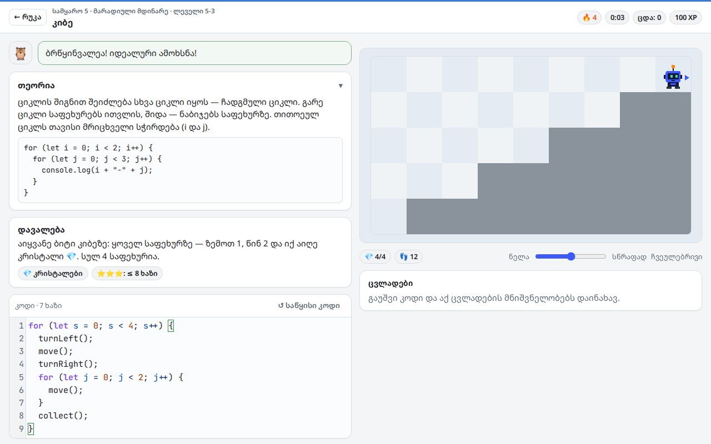
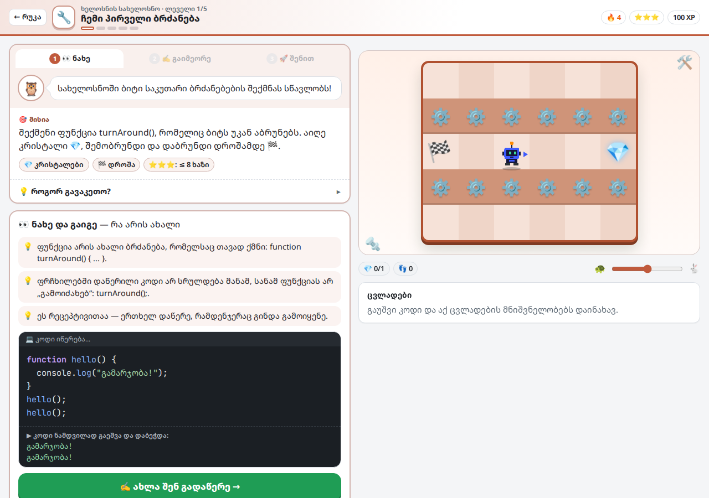
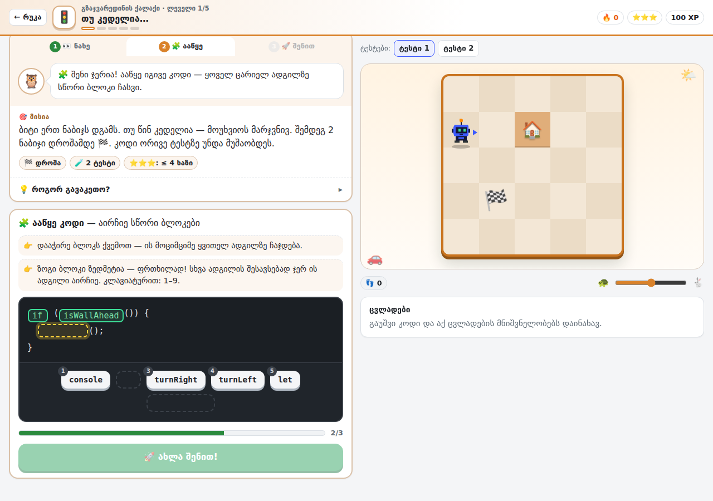
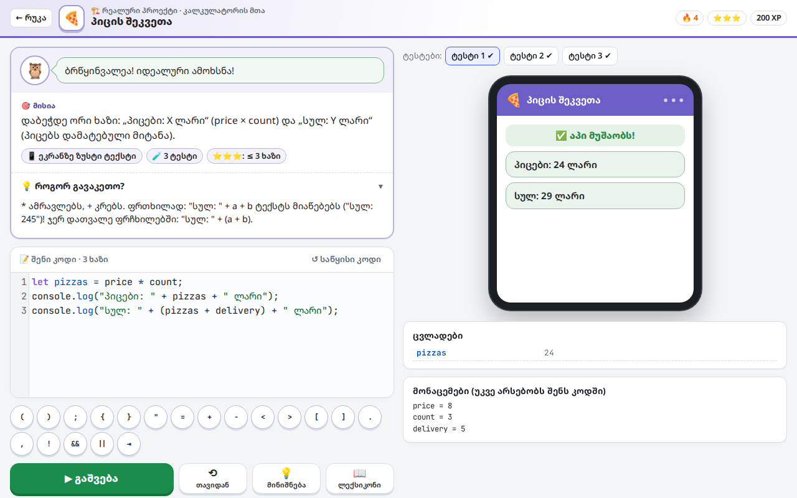
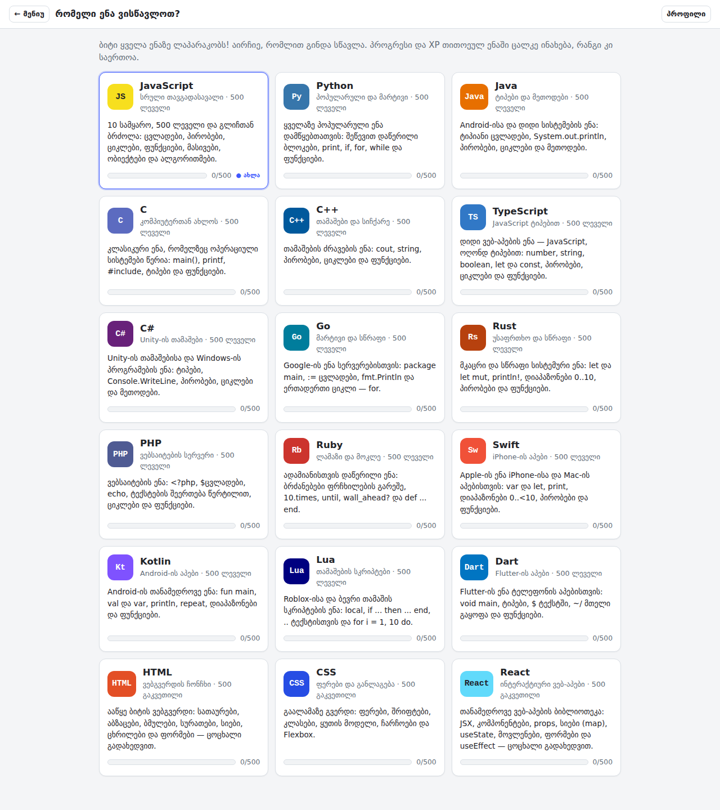
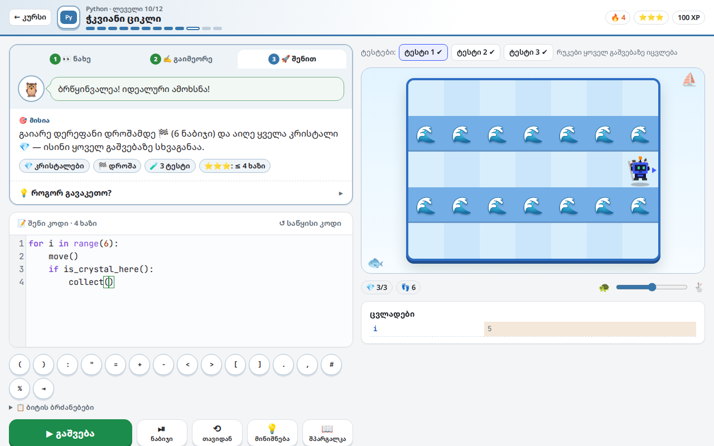
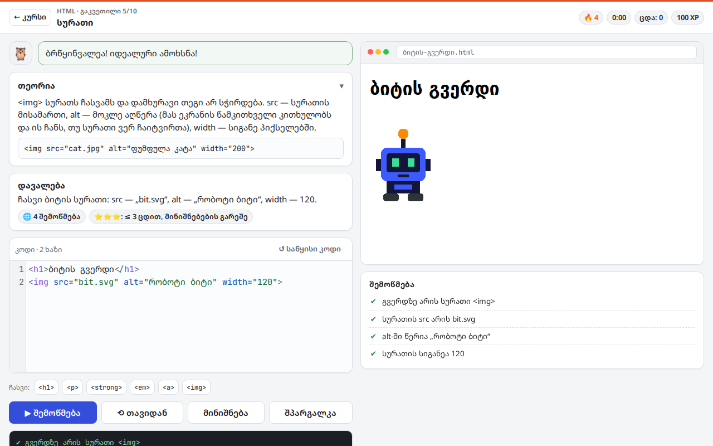
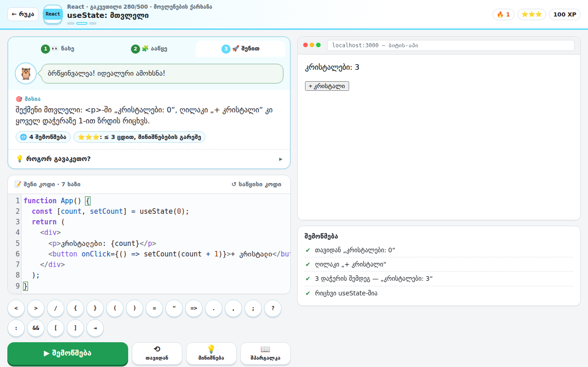
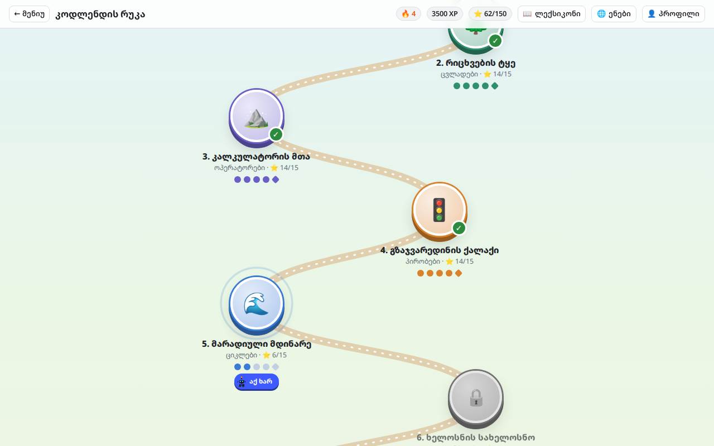
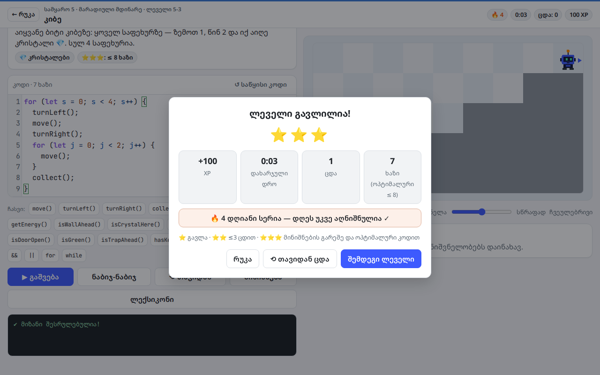

# CodeQuest: ბიტის თავგადასავალი

სასწავლო თამაში, რომელიც პროგრამირებას ნულიდან გასწავლის — **18 ენაზე: JavaScript, TypeScript, Python, Java, C, C++, C#, Go, Rust, PHP, Ruby, Swift, Kotlin, Lua, Dart, HTML, CSS და React**. რობოტ ბიტს კოდით მართავ: წერ ბრძანებებს, უშვებ და უყურებ, როგორ ასრულებს მათ ბიტი რუკაზე. HTML-სა და CSS-ში ბიტის ვებგვერდს აწყობ, React-ში კი ინტერაქტიურ აპს — და შედეგს მაშინვე ხედავ. თამაში მთლიანად ქართულადაა, შეცდომების ახსნის ჩათვლით.

ყოველ ენაზე კურსი **500 ლეველია** (18 ენაზე სულ 9000), იხ. [500 ლეველი ყოველ ენაზე](#500-ლეველი-ყოველ-ენაზე).

### ▶ [ითამაშე ბრაუზერში](https://lazarepataraia910-jpg.github.io/fanycod/)

> ბმული იმუშავებს მას შემდეგ, რაც რეპოში GitHub Pages ჩაირთვება (იხ. [GitHub Pages-ზე გამოქვეყნება](#github-pages-ზე-გამოქვეყნება)).



## როგორ ვსწავლობთ: ნახე → ააწყე → შენით

ყოველი ახალი თემა სამ ნაბიჯად ისწავლება:

1. **👀 ნახე** — ახსნა მოკლე ბარათებად და კოდი, რომელიც თვალწინ იწერება. მაგალითი ნამდვილად ეშვება: ან ბიტი ასრულებს მას დაფაზე, ან ეკრანზე ჩანს, რა დაიბეჭდა.
2. **🧩 ააწყე** — Duolingo-ს სტილი: იგივე კოდში ყველაზე მნიშვნელოვანი სიტყვები (ბრძანებები, საკვანძო სიტყვები, რიცხვები, HTML-ის ტეგები, CSS-ის თვისებები) ცარიელ ადგილებად იქცევა, ქვემოთ კი ბლოკებია. დააჭერ ბლოკს და ის მოციმციმე ადგილზე ჩაჯდება. 2–3 ბლოკი ზედმეტია და სწორს ჰგავს (`turn_left` ↔ `turn_right`, `2` ↔ `3`, `h1` ↔ `header`). შეცდომაზე ბლოკი წითლდება და ირხევა, ორი შეცდომის შემდეგ სწორი ბლოკი ანათებს. კომპიუტერზე ბლოკი კლავიშებით 1–9-ც ირჩევა. ბეჭდვა არ გჭირდება, ამიტომ ტელეფონზეც მოსახერხებელია. პირველი აწყობა +20 XP-ს მოგცემს.
   - **⚙️ პარამეტრები → სწავლის სტილი**: ბლოკების ნაცვლად შეგიძლია აირჩიო **✍️ ასო-ასო გადაწერა**. ამ დროს მაგალითს ერთხელ ხელით გადაწერ: სწორი ასო მწვანდება, შეცდომა წითლდება, ითვლება სიზუსტე, სიჩქარე და კომბო 🔥. ქართული ტექსტი, კომენტარები და შეწევა თავისით ჩაიწერება.
3. **🚀 შენით** — მისიას თავად წერ. ბრძანებები ღილაკის დაჭერით აღარ ჩაიწერება: ღილაკები მხოლოდ ძნელად ასაკრეფ სიმბოლოებს სვამს (`( ) ; { } "` და სხვ.), ბიტის ბრძანებების სია კი ცნობარად ჩანს.

პრაქტიკაზე, ბოსზე და უკვე გავლილ ლეველზე პირდაპირ „შენით“ იწყება. გაკვეთილის ხელახლა სანახავად ნაბიჯების ზოლში „1 ნახე“ დააჭირე.

<p>
  
  
</p>

### რეალური პროექტები

ყოველი სამყაროს ბოსის შემდეგ იხსნება **რეალური პროექტი**: პატარა აპი, რომლის კოდიც ნამდვილ პროგრამებში ზუსტად ასე იწერება. შედეგი ტელეფონის ეკრანზე ჩანს, კოდი კი რამდენიმე ტესტზე მოწმდება სხვადასხვა მონაცემით. თუ, მაგალითად, `"სულ: " + pizzas + delivery` დაწერე, აპი „სულ: 245 ლარი“-ს აჩვენებს 29-ის ნაცვლად — ზუსტად ის შეცდომა, რასაც ნამდვილი პროგრამისტებიც უშვებენ.

| სამყარო | პროექტი | რას აკეთებს |
|---|---|---|
| 2 | 🪪 პროფილის ბარათი | ცვლადებიდან აწყობს პროფილს |
| 3 | 🍕 პიცის შეკვეთა | ითვლის კალათის ჯამს მიტანით |
| 4 | 🎬 კინოს ბილეთი | ასაკის მიხედვით ირჩევს ბილეთს |
| 5 | 🚀 რაკეტის გაშვება | უკუთვლა ციკლით |
| 6 | 🧾 ჩაის ფულის კალკულატორი | ფუნქცია, რომელიც პასუხს აბრუნებს |
| 7 | 🛒 საყიდლების კალათა | ჩეკი ორი მასივიდან |
| 8 | ⛅ ამინდის აპი | ობიექტის მონაცემები და პირობა |
| 9 | 🏆 ლიდერბორდი | სამი საუკეთესო შედეგი |
| 10 | 🔐 პაროლის შემმოწმებელი | პაროლის სიძლიერის შემოწმება |



## ენები



| ენა | კურსი | რას ისწავლი |
|-----|-------|-------------|
| **JavaScript** | 500 ლეველი, 10 სამყარო | სრული თავგადასავალი: ცვლადები, პირობები, ციკლები, ფუნქციები, მასივები, ობიექტები, ალგორითმები |
| **Python** | 500 ლეველი | შეწევით დაწერილი ბლოკები, `print`, `if`/`elif`, `for`/`range`, `while`, `def` |
| **Java** | 500 ლეველი | ტიპები, `System.out.println`, პირობები, ციკლები, მეთოდები |
| **C** | 500 ლეველი | `main()`, `#include`, `printf`, ტიპები, ფუნქციები |
| **C++** | 500 ლეველი | `cout`, `string`, პირობები, ციკლები, ფუნქციები |
| **TypeScript** | 500 ლეველი | ტიპები (`number`, `string`, `boolean`), `let`/`const`, `console.log`, პირობები, ციკლები, ფუნქციები |
| **C#** | 500 ლეველი | `Console.WriteLine`, `int`/`string`/`var`, `$"..."`, `foreach`, მეთოდები დიდი ასოთი (`Move()`) |
| **Go** | 500 ლეველი | `package main`, `:=`, `fmt.Println`, ერთადერთი ციკლი — `for`, ფუნქციები |
| **Rust** | 500 ლეველი | `fn main`, `let`/`let mut`, `println!`, დიაპაზონები `0..10`, `step()` (`move` Rust-ში დაკავებულია) |
| **PHP** | 500 ლეველი | `<?php`, `$ცვლადები`, `echo`, ტექსტის შეერთება `.`-ით, `foreach`, ფუნქციები |
| **Ruby** | 500 ლეველი | ბრძანებები ფრჩხილების გარეშე, `10.times do`, `until`, `wall_ahead?`, `def ... end` |
| **Swift** | 500 ლეველი | `var`/`let`, `print`, ჩადგმა `\(x)`, `0..<10`, `func` |
| **Kotlin** | 500 ლეველი | `fun main`, `val`/`var`, `println("$x")`, `repeat`, `0 until 10` |
| **Lua** | 500 ლეველი | `local`, `if ... then ... end`, ტექსტის შეერთება `..`-ით, `for i = 1, 10 do`, 1-დან დანომრილი სიები |
| **Dart** | 500 ლეველი | `void main`, ტიპები, ჩადგმა `'$x'`, მთელი გაყოფა `~/`, ფუნქციები |
| **HTML** | 500 გაკვეთილი | სათაურები, აბზაცები, ბმულები, სურათები, სიები, ცხრილები, ფორმები, გვერდის სტრუქტურა |
| **CSS** | 500 გაკვეთილი | ფერები, შრიფტები, კლასები და id, ყუთის მოდელი, ჩარჩოები, Flexbox |
| **React** | 500 გაკვეთილი | JSX, კომპონენტები, `props` და `children`, სიები (`map`, `filter`, `key`), პირობითი ჩვენება, `onClick`, `useState`, ფორმები, `useEffect` |

დანარჩენი რობოტის ენების კურსებში იგივე ბიტი და იგივე რუკებია, ოღონდ კოდს ნამდვილი ენის სინტაქსით წერ: Python-ში `turn_left()` და შეწევა, C-ში `int main()`, `printf` და `;`, C#-სა და Go-ში `Move()`, Ruby-ში `move` და `wall_ahead?`, Rust-ში `step()`. ბეჭდვაც ნამდვილივით ხდება: Go `[1 2 3]`-ს ბეჭდავს, C# — `True`-ს, Kotlin და Lua — `3.0`-ს. ყოველ ენას აქვს საკუთარი **რუკა** (ლეველები თემების მიხედვით კუნძულებადაა დაყოფილი, როგორც JavaScript-ში), **შპარგალკა**, ბოსი ბაგიანი კოდით და საკუთარი **სერტიფიკატი**. HTML-სა და CSS-ში გვერდი მარჯვნივ ცოცხლად განახლდება, ხოლო ▶ შემოწმება დავალების ყველა პუნქტს სათითაოდ ამოწმებს.

**React**-ში კოდი ნამდვილ React 18-ზე ეშვება (`function App() { … }`, `useState`, `useEffect`; `import`/`export` ხაზებიც შეიძლება). JSX-ს პატარა ჩაშენებული კომპილატორი თარგმნის, აპი კი იზოლირებულ iframe-ში ეშვება. მარჯვენა გადახედვა ინტერაქტიულია: ღილაკებს აჭერ და ველებში წერ. ▶ შემოწმება აპს რამდენჯერმე თავიდან უშვებს, თვითონ აჭერს ღილაკებს და წერს ველებში, მერე კი შედეგს ამოწმებს. `console.log` კონსოლში ჩანს, შეცდომები კი ქართულად იხსნება: დაუხურავი ტეგი ხაზის ნომრით, უცნობი ცვლადი, `onClick={f()}`-ით გამოწვეული უსასრულო გადახატვა, უსასრულო ციკლი. ბოსებში გლიჩი ტიპურ ბაგებს მალავს: `class` `className`-ის ნაცვლად, `onclick`, დაკარგული `key`, `push` ახალი მასივის ნაცვლად.

<p>
  
  
</p>



## 500 ლეველი ყოველ ენაზე

ყოველი ენის კურსი 500 ლეველია (HTML-ში, CSS-სა და React-ში — 500 გაკვეთილი), 18 ენაზე სულ 9000. რუკაზე ლეველები თავებადაა (კუნძულებად) დალაგებული და რიგრიგობით იხსნება. კუნძულებს ნომერი არ აწერია: ყოველ კუნძულზე ჩანს, კურსის რომელი ლეველები უჭირავს (მაგალითად, ბოლოზე — 489–500), და ყოველ ლეველს თავისი წერტილი აქვს.

- **ახალი თემა იწყება ხელით დაწერილი ლეველით**, „ნახე → ააწყე → შენით“ სწავლებით. ასეთი ლეველები JavaScript-ში 50-ია (10 სამყაროში), დანარჩენ 14 რობოტის ენაზე — 12, HTML-სა და CSS-ში — 10.
- **მის შემდეგ მოდის სავარჯიშო თავები**: თითოში 11–13 ლეველია იმავე თემაზე, და ისინი თანდათან რთულდება.
- **ყოველი თავის ბოლოს ბოსია** 👾: კოდი უკვე დაწერილია, მაგრამ გლიჩმა მასში 1–3 ბაგი ჩადო.
- **კურსის მეორე ნახევარში** ახალი გამოწვევებია:
  - **რობოტის ენები** (ყველა, HTML-ისა და CSS-ის გარდა):
    - ახალი მექანიკები: სარკის ასლი 🪞, ტელეპორტები ✨, `go()` მიმართულებები, კოორდინატები (`getX()`, `flagX()`);
    - გამოთვლები და პირობები: მთელი გაყოფა და ნაშთი, `else if` ჯაჭვები, შუქნიშნები;
    - მარშრუტები: ოთახის შემოვლა, გველის მარშრუტი `% 2`-ით, ნამდვილი ლაბირინთები (მარჯვენა ხელის წესი);
    - ფუნქციები და ალგორითმები: რეკურსია, ორობითი ძებნა, დალაგება, მასივები, ციფრების ამოცანები;
    - ბოლოს — მრავალსაფეხურიანი მისიები და ოსტატის გამოცდები.
  - **HTML**: რადიო-ღილაკები, `datalist`, `rowspan`, `details`, `dl`, `meta`, ხელმისაწვდომობა (`aria-label`), entity-ები, სტატიები, საიტის ჩონჩხი, ბლოგი და სადესანტო გვერდი.
  - **CSS**: `em`/`rem`/`%`, `rgb()`/`hsl()`, `box-sizing`, გრადიენტები, `position`, `z-index`, Flexbox III, Grid II, `::before`/`::after`, `:nth-child(3n)`, ატრიბუტის სელექტორები, `transform`, CSS ცვლადები და პროექტები.
- **JavaScript-ის ისტორია** იგივე რჩება: საბოლოო სამყარო, „გლიჩის ციხე“, კურსის ბოლოს არის (ლეველები 496–500).
- ბევრ ლეველს რამდენიმე ტესტ-რუკა აქვს, ამიტომ კოდი ზოგადი უნდა იყოს: სენსორებით, ციკლებით და ცვლადებით.
- **XP:** სავარჯიშო ლეველი 50 XP-ს იძლევა, თავის ბოსი — 150-ს.

## JavaScript-ის სამყაროები

| # | სამყარო | თემა |
|---|---------|------|
| 1 | 🌱 მწვანე ველი | პირველი ნაბიჯები |
| 2 | 🌲 რიცხვების ტყე | ცვლადები |
| 3 | ⛰️ კალკულატორის მთა | ოპერატორები |
| 4 | 🚦 გზაჯვარედინის ქალაქი | პირობები |
| 5 | 🌊 მარადიული მდინარე | ციკლები |
| 6 | 🔧 ხელოსნის სახელოსნო | ფუნქციები |
| 7 | 📦 საწყობის ქვესკნელი | მასივები |
| 8 | 🏙️ ობიექტების ქალაქი | ობიექტები |
| 9 | 🗼 ალგორითმების კოშკი | ალგორითმები |
| 10 | 🏰 გლიჩის ციხე | საბოლოო გამოცდა |

თითოეულ სამყაროში 5 ლეველია: სამი ახალ თემაზე, ერთი სავარჯიშო და ბოსი. ბოლო ბოსს (გლიჩს) 3 ფაზა აქვს. სამყაროებს შორის სავარჯიშო თავებია, ამიტომ JavaScript-ის კურსში სულ 500 ლეველია.

## შესაძლებლობები

- **ყოველ სამყაროს თავისი სახე აქვს:** ბალახი და ხეები, ტყე, მთა, ქალაქი, მდინარე, სახელოსნო... ლეველის ეკრანზე ერთი „მისიის“ ბარათია — ვინ რას ამბობს, რა უნდა გააკეთო და „💡 როგორ?“ ახსნა მაგალითით.
- **კოდის რედაქტორი** ფერადი სინტაქსით, დიდი ფერადი ბრძანების ღილაკები დამწყებთათვის, **ნაბიჯ-ნაბიჯ რეჟიმი** და **ცვლადების პანელი**.
- **შეცდომები ქართულად** ყველა ენაზე: თამაში ხსნის, რა მოხდა, და ხაზს მიუთითებს — მაგ. „ხაზის ბოლოს ; აკლია“, „Python-ში ეს ბრძანება ასე იწერება: turn_left()“, „printf-ისთვის საჭიროა #include <stdio.h>“.
- **ვარსკვლავები:** ⭐ გავლა · ⭐⭐ ≤ 3 ცდით · ⭐⭐⭐ მინიშნებების გარეშე და ოპტიმალური კოდით. ზედა ზოლში ყოველთვის ჩანს, რამდენი ვარსკვლავის აღება შეგიძლია ახლა.
- **XP, რანგები და 55 მიღწევა** (მათ შორის „პოლიგლოტი“, „სნაიპერი“ — უშეცდომოდ აწყობილი კოდი — „აპების ოსტატი“ და „მოდის ხატი“). XP-ით იხსნება რედაქტორის თემებიც.
- **👕 ბიტის გარდერობი** — მთავარ ლოგოზე დაჭერით იხსნება. ბიტი დიდად ჩანს სცენაზე, 8 კატეგორიაა: ფერი, ქუდები, ტანსაცმელი, სათვალე, კისერზე, ზურგზე, ფეხსაცმელი, ანტენა. **275 უნიკალური ნივთია**: ყოველი ფორმა მხოლოდ ერთხელ, ფერადი ასლების გარეშე. მაგალითად 18 პროგრამირების ენის მაისური, ჩოხა, ნაბადი, საქართველოს დროშა, კიმონო, დრაკონის ფრთები და ლაზერის თვალები. ვინც ფერადი ასლი ადრე იყიდა, მისთვის ის რჩება.
  - **6 იშვიათობა:** ჩვეულებრივი (ნაცრისფერი), არაჩვეულებრივი (მწვანე), იშვიათი (ლურჯი), ეპიკური (იისფერი), ლეგენდარული (ნარინჯისფერი, ბრწყინავს) და მითიური (ცისარტყელას ჩარჩოთი). ბარათის ფონი და ჩარჩო იშვიათობის ფერისაა, ფასიც იშვიათობაზეა დამოკიდებული: დაახლოებით 150-დან 4000 XP-მდე. ნივთებს იშვიათობით ფილტრავ და ალაგებ.
  - **ფერები:** ჩვეულებრივი ფერები უფასოა, იშვიათები (ოქრო, ყინული, ლავა, გალაქტიკა, ცისარტყელა...) XP-ით იყიდება. სულ 29 ფერია, ერთი ფერის ღია და მუქი ჩრდილების გარეშე.
  - ნივთები ფორმისა (შაბლონის) და ფერის (პალიტრის) შეხამებით იქმნება: `CodeQuest.html`-ის ბლოკი `===WARDROBE===`. მაღაზიაში ყოველი ფორმიდან ერთი ჩანს; დანარჩენ ფერად ასლებს `retired` აქვთ და მხოლოდ მათ ყიდველებს უჩანთ. ⚠️ ნივთის id-ს (შაბლონი-პალიტრა) ნუ შეცვლი — ნაყიდი ნივთები მისით ინახება.

  ნივთზე დაჭერით ჯერ მოსინჯავ — ბიტს ეკრანზე აცვია — და მერე ყიდულობ. XP-ის ხარჯვა წოდებას არ ამცირებს: წოდება მთელ მოგებულ XP-ს ითვლის, საფულეში კი მოგებულს გამოკლებული დახარჯული რჩება. ნაყიდი ტანსაცმელი ბიტს თამაშის დაფაზეც აცვია.
- **დღის გამოწვევა** (ყოველ დღე ახალი რუკა) და **დღის სერია** 🔥.
- **ქვიზი** და „რეალურ ცხოვრებაში“ ახსნა ყოველი სამყაროს ბოსის შემდეგ.
- **ლექსიკონი** (JavaScript) და **შპარგალკა** ყველა სხვა ენისთვის.
- **ენების სია:** ძებნა და დალაგება — ყველაზე ხშირად ნათამაშები, ბოლოს ნათამაშები, პოპულარობით მსოფლიოში, რისთვის გამოიყენება (ვებსაიტები, აპები, თამაშები…), პროგრესით ან ანბანით. ენა ★-ით **რჩეულებში** ემატება: რჩეულები სიის თავში და მთავარ მენიუში ჩანს.
- **თავისუფალი რეჟიმი:** ააწყე საკუთარი რუკა და გაუზიარე მეგობარს კოდით.
- **სპიდრანი:** გავლილი ლეველის ხელახლა გავლა დროზე.
- **სერტიფიკატი** ყოველი დასრულებული ენისთვის (ჩამოიტვირთება PNG-ად).
- ნათელი და მუქი თემა, ხმა, ანიმაციის სიჩქარე, შრიფტის ზომა და **მასწავლებლის რეჟიმი** (ყველა უფასო ლეველი ღიაა).
- მუშაობს კომპიუტერზეც და ტელეფონზეც.
- **💻 კომპიუტერის ვერსია:** ცალკე პროგრამა Windows-ის, macOS-ისა და Linux-ისთვის, მუშაობს ინტერნეტის გარეშეც (იხ. [კომპიუტერის ვერსია](#-კომპიუტერის-ვერსია-windows-macos-linux)).
- **👤 ანგარიშები:** სახელით და პაროლით, ელფოსტის გარეშე. პროგრესი, Pro და ბიტის ნივთები ყველა მოწყობილობაზე ერთია (იხ. [ანგარიშები](#-ანგარიშები-შესვლა-და-რეგისტრაცია)).
- **👩‍🏫 კლასები (👑 Pro — მასწავლებელსაც და მოსწავლესაც სჭირდება):** მასწავლებელი ქმნის კლასს და ხედავს მოსწავლეების პროგრესს. მოსწავლეები 6-ასოიანი კოდით უერთდებიან და ხედავენ კლასის კვირის რეიტინგს.
- **🔴 ცოცხალი გაკვეთილი:** მასწავლებელი კლასში იწყებს გაკვეთილს და ირჩევს ენას. მოსწავლეებს ეკრანზე ორი დაფა აქვთ: მასწავლებლისა, რომელიც ცოცხლად ჩანს (კოდი და გაშვების შედეგი ბრაუზერის ფანჯარაში გვერდით), და საკუთარი, სადაც თავად წერენ და უშვებენ.
- **🛍️ დღის შეთავაზება:** გარდერობში ყოველდღე 6 ნივთი 30%-ით იაფია. შეთავაზება ყველასთვის ერთნაირია და შუაღამისას იცვლება.
- **📱 ტელეფონზე დაყენება (PWA):** საიტი ტელეფონზე აპივით დგება, ხატულით მთავარ ეკრანზე, და ინტერნეტის გარეშეც იხსნება (`manifest.webmanifest`, `sw.js`).

<p>
  
  
</p>

## Pro და გადახდები (Dodo Payments)

**ყოველ ენაზე პირველი 100 ლეველი უფასოა.** დანარჩენს ერთჯერადი გადახდა — **CodeQuest Pro** — ხსნის ყველა ენაზე ერთად.

Pro ხსნის **🎬 ვიდეოებისა და პროექტების** გვერდსაც (მთავარ მენიუში — „ვიდეოები და პროექტები“):
- **180 ვიდეო — ყოველ ენაზე 10**, საიტზევე იყურება: ქართული გაკვეთილები (Jortsoft, ნოვატორი, BitCamp, GOA, ჯეოლაბი და სხვ.), Fireship-ის „100 წამში“, freeCodeCamp-ის, Programming with Mosh-ის, Bro Code-ის კურსები და პროექტები. ყოველი ვიდეო შემოწმებულია: არსებობს და საიტში ჩასმა ნებადართულია. ქვემოთ არის „მეტი“ ბმულებიც: YouTube-ის ძებნა და TikTok.
- **რედაქტორი ვიდეოს ქვემოთ** — VS Code-ის მსგავსი ფანჯარა. ვიდეოს კოდს თავად წერ და **▶ Run**-ით უშვებ. ის იმავე იზოლირებულ Worker-ში ეშვება, რაც ლეველები, ლიმიტებით და ქართული შეცდომებით. HTML/CSS/React-ზე შედეგი გადახედვის ფანჯარაში ჩანს.
- **💾 Save** კოდს **📒 ჩანაწერებში** ინახავს (ამავე ბრაუზერში). იქიდან ჩანაწერს გახსნი ვიდეოსთან ერთად, დააკოპირებ ან წაშლი. თითო ენაზე ბოლო დრაფტიც თავისით ინახება.
- **ნაბიჯ-ნაბიჯ პროექტები** — ყოველ ენაზე ნამდვილი პატარა პროგრამა, რომელსაც თამაშის გარეთ აწყობ: საქმეების სია (JavaScript), გამოიცანი რიცხვი (Python), თამაში LÖVE-ში (Lua), Flutter-ის აპი (Dart), წამზომი (React) და სხვ. ყოველ ნაბიჯს აქვს ახსნა, კოდი კოპირების ღილაკით და „✓ გავაკეთე“ ნიშანი. ბოლოს მოცემულია მთლიანი კოდი, სად გაუშვა და იდეები გასაგრძელებლად.

ვიდეოები `STUDIO_VIDEOS`-შია, გზამკვლევები — `STUDIO_GUIDES`-ში, ორივე ფაილის `===STUDIO===` ბლოკში.

ყიდვა [Dodo Payments](https://dodopayments.com)-ით ხდება: მყიდველი გადახდის გვერდზე იხდის, ელფოსტაზე **ლიცენზიის კოდს** იღებს და თამაშში ჩასვამს (Pro-ს ფანჯარა ან **პარამეტრები → CodeQuest Pro**). კოდს თამაში Vercel-ის ფუნქციით [`api/license.js`](api/license.js) ამოწმებს — Dodo-ს API ბრაუზერიდან პირდაპირ არ იძახება. საიდუმლო გასაღები არ სჭირდება.

ჩასართავად ერთჯერადად:

1. დარეგისტრირდი [Dodo Payments](https://dodopayments.com)-ზე და გაიარე ბიზნესის ვერიფიკაცია.
2. **Products → Create product:** ერთჯერადი გადახდა (One-time), შენი ფასით. პროდუქტზე ჩართე **License keys**.
3. პროდუქტის გვერდზე **Share** — დააკოპირე გადახდის ბმული (მაგ. `https://checkout.dodopayments.com/buy/pdt_...`) და ჩასვი `CodeQuest.html`-ში, `PRO.payLink`-ში (იქვე `PRO.price` — ღილაკზე გამოსაჩენი ფასი). ახლა იქ **სატესტო** ბმულია (`test.checkout...`) — ნამდვილი გაყიდვებისთვის Live Mode-ის ბმულით შეცვალე.
4. **Vercel → Project → Settings → Environment Variables:**
   - `DODO_MODE` = `test` (სატესტო გადახდებისთვის) ან `live` (ნამდვილისთვის);
   - `PRO_PRIVATE_KEY` — Pro-ს ხელმოწერის საიდუმლო გასაღები (ECDSA P-256, PKCS8 DER base64 ერთ ხაზზე). მისი საჯარო ნაწილი `CodeQuest.html`-შია, `PRO.pub`-ში;
   - `OWNER_KEYS` — მფლობელის კოდები მძიმით: ასეთი კოდი Pro-ს უფასოდ რთავს, Dodo-ს გარეშე.

   შემდეგ გააკეთე Redeploy.
5. სატესტო რეჟიმში შეიძინე Dodo-ს სატესტო ბარათით, ელფოსტიდან კოდი თამაშში ჩასვი — ფასიანი ლეველები უნდა გაიხსნას.

**Pro-ს დაცვა.** კოდის შემოწმების შემდეგ სერვერი (`api/license.js`) Pro-ს ნიშანს (token) საიდუმლო გასაღებით აწერს ხელს. თამაში Pro-ს მხოლოდ ამ ხელმოწერის შემოწმების შემდეგ რთავს (`ProLock`, Web Crypto). ამიტომ:
- ბრაუზერის შენახულ მონაცემებში ან კონსოლში Pro-ს ხელით ჩართვა აღარ მუშაობს;
- Pro-ს შემოწმების ფუნქციები და `PRO`-ს პარამეტრები ჩაკეტილია (`Object.freeze`, `defineProperty`);
- ძველი შენახვის კოდი ჩატვირთვისას სერვერზე თავიდან მოწმდება.

> **შენიშვნა:** თამაში მთლიანად ბრაუზერში მუშაობს და მისი კოდი საჯაროა, ამიტომ ადამიანი, რომელიც ფაილს თავად ჩამოტვირთავს და შეცვლის, დაცვას მაინც აუვლის გვერდს. სრული დაცვისთვის ფასიანი შინაარსი სერვერიდან უნდა მიეწოდებოდეს, მომხმარებლის ანგარიშებით. კოდის შემოწმება მხოლოდ Vercel-ზე მუშაობს (GitHub Pages-სა და ლოკალურ ფაილზე ფუნქცია არ არის).

## 💻 კომპიუტერის ვერსია (Windows, macOS, Linux)

CodeQuest ცალკე პროგრამადაც არსებობს: საკუთარი ფანჯარა და ხატულა სამუშაო მაგიდაზე, ბრაუზერი არ სჭირდება. გადმოსაწერად საიტის მთავარ მენიუში დააჭირე **💻 კომპიუტერის ვერსია**, ან გახსენი [CodeQuest.html#download](https://codequest-lazare.vercel.app/CodeQuest.html#download). საიტი შენს სისტემას თავად ამოიცნობს.

| სისტემა | ფაილი | დაყენება |
|---|---|---|
| Windows 10/11 | `CodeQuest-Setup.exe` | გახსენი, თავისით დაყენდება. თუ გამოჩნდა „Windows protected your PC“, დააჭირე **More info → Run anyway**. |
| macOS (M-ჩიპი და Intel) | `CodeQuest.dmg` | გადაიტანე Applications-ში. პირველად: **System Settings → Privacy & Security → Open Anyway**. |
| Linux | `CodeQuest.AppImage` | მიეცი გაშვების უფლება (`chmod +x`) და გაუშვი. |

როგორ მუშაობს (საქაღალდე [`desktop/`](desktop/), Electron):

- თამაში იხსნება მისამართზე `codequest://app/CodeQuest.html`. ინტერნეტით ის ყოველთვის ახალ ვერსიას იღებს საიტიდან და ასლს კომპიუტერში ინახავს, ამიტომ ახალი ლეველები პროგრამის თავიდან გადმოწერის გარეშე ჩანს.
- ინტერნეტის გარეშე იხსნება ბოლოს შენახული ასლი, ან პროგრამასთან მოყოლილი. CodeMirror, React და შრიფტები პროგრამაშივეა.
- `/api/license` საიტზე გადაიგზავნება, ამიტომ Pro-ს ლიცენზიის კოდი პროგრამაშიც მუშაობს. გადახდა ბრაუზერში იხსნება.
- YouTube-ის ვიდეოები, გარე ბმულები და გადახდა ჩვეულებრივ ბრაუზერში იხსნება.
- პროგრესი პროგრამაში ცალკე ინახება. გადასატანად გამოიყენე **პარამეტრები → პროგრესის კოდი**.

**ახალი ვერსიის გამოშვება.** [`.github/workflows/desktop.yml`](.github/workflows/desktop.yml) `desktop/`-ის ყოველ ცვლილებაზე GitHub Actions-ში აწყობს სამივე ფაილს და დებს [Releases](https://github.com/lazarepataraia910-jpg/fanycod/releases)-ში, ტეგით `desktop-v<ვერსია>`. ახალი რელიზისთვის `desktop/package.json`-ში გაზარდე `version`. იგივე ვერსიაზე ფაილები უბრალოდ განახლდება. საიტის ბმულები ყოველთვის ბოლო რელიზზე მიდის.

ლოკალურად (Node 22+):

```bash
cd desktop
npm ci
npm start          # გაშვება
npm run dist       # ინსტალერი ამ სისტემისთვის → desktop/dist/
```

სატესტოდ: `CODEQUEST_SITE=http://127.0.0.1:8080` თამაშს ლოკალური სერვერიდან ჩატვირთავს, `CODEQUEST_OFFLINE=1` კი ინტერნეტის გათიშვას აჩვენებს.

> პროგრამა ფასიანი ციფრული ხელმოწერის გარეშეა, ამიტომ Windows და macOS პირველ გაშვებაზე გაფრთხილებას აჩვენებს. ხელმოწერისთვის საჭიროა სერტიფიკატი (Windows) და Apple Developer-ის ანგარიში (macOS).

## როგორ ვითამაშო საკუთარ კომპიუტერზე

ჩამოტვირთე [`CodeQuest.html`](CodeQuest.html) და გახსენი ბრაუზერში. სერვერი და ინსტალაცია არ სჭირდება.

ინტერნეტი საჭიროა მხოლოდ შრიფტებისა და CodeMirror რედაქტორისთვის. მის გარეშე თამაში მაინც მუშაობს, უფრო მარტივი რედაქტორით.

**კლავიშები:** `Ctrl+Enter` — გაშვება · `Ctrl+Shift+Enter` — ნაბიჯ-ნაბიჯ · `Esc` — ფანჯრის დახურვა.

## პროგრესის შენახვა

ანგარიშის გარეშე პროგრესი ბრაუზერში ინახება (`localStorage`), თითოეული მისამართისთვის ცალკე. ამიტომ ლოკალური ფაილის პროგრესი საიტზე თავისით არ გადავა და პირიქით.

სხვა მოწყობილობაზე გადასატანი ორი გზა არსებობს:
- **👤 ანგარიში** (იხ. ქვემოთ), რომელიც პროგრესს თავისით ინახავს;
- **პარამეტრები → პროგრესის კოდი**: დააკოპირე კოდი და მეორე ადგილას „იმპორტით“ ჩასვი.

## 👤 ანგარიშები: შესვლა და რეგისტრაცია

მთავარი მენიუს ზედა ზოლში არის ღილაკი **შესვლა** (იქვეა რეგისტრაციაც). სტუმარს ანგარიში არ სჭირდება და თამაშობს ისე, როგორც ადრე.

ანგარიშით პროგრესი, Pro და ბიტის ნივთები ყველა მოწყობილობაზე ერთია, კომპიუტერის პროგრამის ჩათვლით:
- **რეგისტრაციისთვის საკმარისია სახელი და პაროლი.** ელფოსტა არ გვჭირდება. სახელი 3–20 სიმბოლოა (ქართული ან ლათინური ასოები, ციფრები, `_ . -`), პაროლი კი მინიმუმ 8 სიმბოლო. სახელს სხვა მოთამაშეები ვერ ხედავენ.
- **რეგისტრაციისას მოთამაშე იღებს აღდგენის კოდს** (მაგ. `ABCD-EFGH-2345`). ის ერთხელ ჩანს და შეიძლება დააკოპირო ან ფაილად შეინახო. დავიწყებული პაროლი ამ კოდით აღდგება, რის შემდეგაც ახალი კოდი გაიცემა.
- **ყოველი ცვლილება რამდენიმე წამში სერვერზე ინახება.** თუ სხვა მოწყობილობამ შუალედში შეინახა, პროგრესები ერთიანდება: ლეველებიდან, მიღწევებიდან და ნივთებიდან საუკეთესო რჩება. შესვლისას, თუ ორივეგან არის პროგრესი, თამაში გეკითხება: გაერთიანება თუ მხოლოდ ანგარიშის პროგრესი.
- **გასვლისას ეს მოწყობილობა თავიდან იწყება**, პარამეტრები კი რჩება. სკოლის საერთო კომპიუტერზე ასე შემდეგი მოსწავლე წინას პროგრესს ვერ ნახავს.
- **ანგარიშის პანელიდან** შეიძლება პაროლის შეცვლა (სხვა მოწყობილობებზე სესია უქმდება) და ანგარიშის წაშლა (პაროლით დადასტურებით).

**ჩართვა (ერთხელ, საიტის მფლობელისთვის).** ანგარიშები ინახება უფასო Upstash Redis ბაზაში:
1. Vercel → პროექტი `codequest` → **Storage** → **Create Database** → **Upstash** (Redis) → აირჩიე უფასო გეგმა და ახლო რეგიონი (მაგ. Frankfurt).
2. **Connect Project** → `codequest`. Vercel თავად დაამატებს ცვლადებს `KV_REST_API_URL` და `KV_REST_API_TOKEN`.
3. **Deployments** → ბოლო დეპლოი → **Redeploy**, რომ ფუნქციამ ახალი ცვლადები დაინახოს.

ბაზის გარეშე ღილაკი იმუშავებს, მაგრამ შესვლისას დაწერს, რომ ანგარიშები ჯერ არ არის ჩართული.

**როგორ არის აწყობილი.** [`api/account.js`](api/account.js) არის Vercel-ის ფუნქცია; ყველა მოთხოვნა `POST /api/account { action, ... }`:
- **მოქმედებები:** `register`, `login`, `reset`, `me`, `load`, `save`, `logout`, `password`, `delete`.
- **ჰეშები:** პაროლი და აღდგენის კოდი ინახება მხოლოდ scrypt-ის ჰეშით, შემთხვევითი მარილით.
- **სესია:** ნიშანი (token) 60 დღე მოქმედებს, ბაზაში მხოლოდ მისი sha256 ინახება. ნიშანი თამაშში ცალკე ინახება (`codequest.auth`), ამიტომ არც პროგრესის კოდში ხვდება, არც სერვერზე.
- **მცდელობების ლიმიტი:** შესვლა, რეგისტრაცია და აღდგენა შეზღუდულია IP-ითა და სახელით.
- **შენახვა:** პროგრესი შეკუმშული (gzip) ინახება. ვერსიის (rev) შემოწმება ატომურია (Lua), ამიტომ ორი მოწყობილობა ერთმანეთის ცვლილებებს ვერ წაშლის. თამაში სერვერზე მაქსიმუმ 15 წამში ერთხელ ინახავს, რომ უფასო ბაზის ლიმიტი დიდხანს ეყოს.
- **კლასები:** `classCreate`, `classJoin`, `classLeave`, `classes`, `classView`, `classKick`, `classDelete`. შექმნას, შეერთებას, სიას, ხედს და `liveStart`-ს Pro სჭირდება: თამაში აგზავნის Pro-ს ხელმოწერილ ნიშანს (`pro`), სერვერი მას `PRO.pub`-ის იგივე საჯარო გასაღებით ამოწმებს. სხვა შემთხვევაში პასუხია `pro_required`. გასვლას, წაშლას, ამოგდებას და გაკვეთილის დასრულებას Pro არ სჭირდება.
- **ცოცხალი გაკვეთილი:** `liveStart`, `liveSet`, `liveEnd`. მასწავლებლის დაფა 4 საათი ინახება (`live:<ID>`) და მისი შეცვლა მხოლოდ გაკვეთილის გასაღებით შეიძლება. მოსწავლეები დაფას წამში ერთხელ კითხულობენ `GET /api/account?live=ID`-ით. პასუხი Vercel-ის CDN-ში 1 წამით ინახება, ამიტომ მთელი კლასი ბაზას წამში მხოლოდ ერთხელ მიმართავს.
  - ყოველი შენახვისას, თუ XP ან ლეველები შეიცვალა, თამაში აგზავნის მოკლე შეჯამებას (`sum:<სახელი>`): XP, ლეველები, ვარსკვლავები, ახლანდელი ლეველი, ენების პროგრესი. კვირის XP ამ შეჯამებიდან ითვლება.
  - მასწავლებელი ყველაფერს ხედავს, მოსწავლე კი კლასელების მხოლოდ სახელს და XP-ს.
- **ანონიმური სტატისტიკა:** `stat` აგროვებს მონაცემებს ყოველი მეოთხე სესიიდან: ლეველის id, შეცდომები და გაიარა თუ არა, სახელის გარეშე.
  - მფლობელი შედეგს ხედავს თამაშში: **პარამეტრები → დეველოპერისთვის → „სად ჭედავენ მოთამაშეები“**, მფლობელის კოდით (`OWNER_KEYS`).

**კონფიდენციალურობა:** [`privacy.html`](privacy.html) და [`terms.html`](terms.html). ბმულები ჩანს თამაშის ფუტერში და რეგისტრაციის ფორმაში.

## GitHub Pages-ზე გამოქვეყნება

რეპოში უკვე არის მთავარი გვერდი `index.html` და ცარიელი `.nojekyll` ფაილი.
- **ვინ რას ხედავს:** ახალი სტუმარი ხედავს მშობლებისა და სკოლებისთვის განკუთვნილ გვერდს. ვინც უკვე თამაშობს, ან ვინც ბმულში პარამეტრს მოიყოლებს (მაგ. `#download`), პირდაპირ `CodeQuest.html`-ზე გადადის. `?home` ამ გვერდს ყოველთვის აჩვენებს.
- **გაზიარების სურათი:** `og.png`, რომელიც Facebook-ზე და მესენჯერებში ჩანს.

GitHub Pages-ზე გამოსაქვეყნებლად დარჩა ერთჯერადი ჩართვა: დარჩა ერთჯერადი ჩართვა:

1. გახსენი რეპოს **Settings → Pages**.
2. **Source:** `Deploy from a branch`.
3. **Branch:** `main`, საქაღალდე `/ (root)` → **Save**.
4. 1–2 წუთში თამაში გაიხსნება მისამართზე: https://lazarepataraia910-jpg.github.io/fanycod/

ამის შემდეგ `main`-ზე ყოველი ცვლილება საიტს ავტომატურად განაახლებს. თამაში Vercel-ზეც მუშაობს, დამატებითი პარამეტრების გარეშე.

## დეველოპერისთვის

- ყველაფერი ერთ ფაილშია: `CodeQuest.html` (HTML, CSS და JavaScript, build-ის გარეშე).
- მოთამაშის კოდი Web Worker-ში სრულდება, გვერდისგან იზოლირებულად. ხმები Web Audio API-ით იქმნება, გარე ფაილების გარეშე.
- **სხვა ენები სერვერის გარეშე მუშაობს:** Python, Java, C და C++ კოდი ბრაუზერშივე ითარგმნება JavaScript-ში (სექცია `LANGS` ფაილში). თარჯიმანი ხაზებს ინარჩუნებს, ამიტომ შეცდომა და ნაბიჯ-ნაბიჯ რეჟიმი სწორ ხაზს აჩვენებს. ტიპები მოწმდება ისე, რომ ენის ქცევა ნამდვილს ემთხვეოდეს: C-ში და Java-ში `7 / 2` არის `3`, Python-ში `"x" + 5` შეცდომაა, Java `10.0`-ს ბეჭდავს როგორც `10.0`. მხარდაჭერილია ენის ძირითადი ნაწილი, რაც კურსებს სჭირდება (ცვლადები, პირობები, ციკლები, ფუნქციები, სიები/მასივები და სხვ.). კლასები, მაჩვენებლები და მსგავსი რამ ჯერ არ არის.
- **TypeScript, C#, Go, Rust, PHP, Ruby, Swift, Kotlin, Lua და Dart** ერთი საერთო თარჯიმნით ითარგმნება (სექცია „NL — ახალი ენების თარჯიმანი“, `nlCompile`). ენებს შორის განსხვავება ცხრილებშია აღწერილი:
  - სინტაქსი (`NL_D`): კომენტარები, ტექსტში ჩადგმა (`${x}`, `{x}`, `#{x}`, `\(x)`, `$x`), ბლოკები `{ }` თუ `end`, სავალდებულო `;`;
  - ქცევა (`NL_SEM`): `7 / 2` არის `3` თუ `3.5`, შეიძლება თუ არა `"x" + 5`, იბეჭდება თუ არა `5.0` როგორც `5.0`.
  - Go-ში გამოუყენებელ ცვლადზე გაფრთხილება ჩნდება, Kotlin-ში `val`-ის შეცვლა შეცდომაა, Lua-ში სია 1-დან ითვლება — როგორც ნამდვილ ენებში.
- **გენერირებული ლეველები ფაილში მზა სახით არ ინახება** (სექცია `DRILLS`). ყოველი ლეველი გენერატორით იქმნება seed-იდან (ენა + ნომერი), ამიტომ ყოველთვის ერთნაირია. კურსის რიგს — რომელი თავი რის შემდეგ მოდის — `coursePlan` აწყობს.
  - რობოტის ლეველების ამოხსნა იწერება პატარა შუალედურ ენაზე (IR). მისგან ავტომატურად იქმნება ყველა 15 რობოტის ენის კოდი (`nlEmit` — ახალი ათი ენისთვის).
  - ბოსის ბაგები ამოხსნის მუტაციით ჩნდება. რჩება მხოლოდ ის ბაგი, რომელიც ტესტს მართლაც ჩააგდებს.
- HTML/CSS-ის გადახედვა იზოლირებულ `iframe`-შია (სკრიპტები იქ არ ეშვება), შემოწმება კი გვერდის DOM-სა და სტილებს ამოწმებს.
- **ავტომატური შემოწმება:** ყოველი ხელით დაწერილი ლეველისა და პროექტის სწორი ამოხსნა ეშვება ყველა ტესტ-რუკაზე, ყველა ენაზე (სულ 249 შემოწმება), ბოსების ბაგიანი და პროექტების საწყისი კოდი კი, პირიქით, უნდა ჩავარდეს. გაშვება შეიძლება სამნაირად:
  - **პარამეტრები → ყველა ლეველის შემოწმება**;
  - ბრაუზერის კონსოლში: `await CodeQuest.testAll()`;
  - `CodeQuest.html#test` მისამართის გახსნით (შედეგი კონსოლში დაიწერება).
- **გენერირებული ლეველების შემოწმება:** 8262 ლეველი ცალკე მოწმდება, იგივე წესით — ამოხსნამ ყველა ტესტი უნდა გაიაროს, ბოსის ბაგიანმა კოდმა კი უნდა ჩავარდეს. გაშვება:
  - `await CodeQuest.testGenerated()` კონსოლში;
  - `CodeQuest.html#testgen` მისამართის გახსნით;
  - **პარამეტრები → ყველა ლეველის შემოწმება** (ორივე შემოწმებას ერთად უშვებს).
