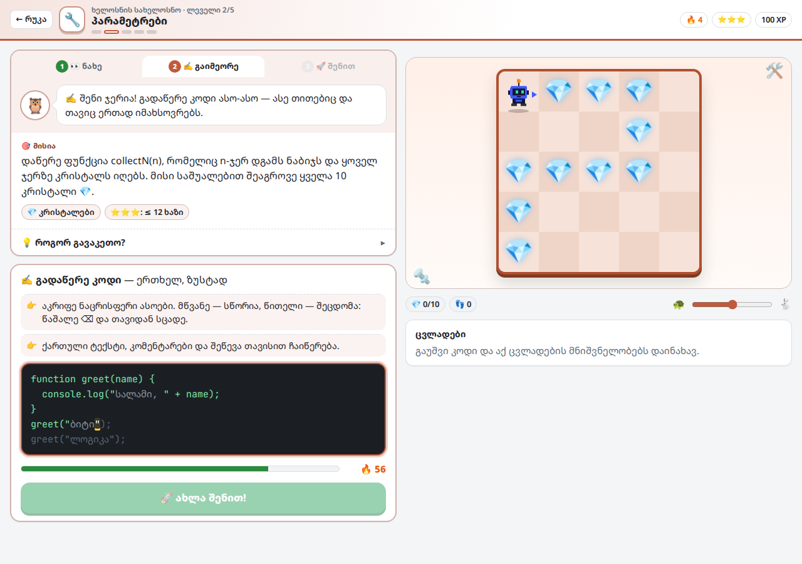

# CodeQuest: ბიტის თავგადასავალი

სასწავლო თამაში, რომელიც პროგრამირებას ნულიდან გასწავლის — **17 ენაზე: JavaScript, TypeScript, Python, Java, C, C++, C#, Go, Rust, PHP, Ruby, Swift, Kotlin, Lua, Dart, HTML და CSS**. რობოტ ბიტს კოდით მართავ: წერ ბრძანებებს, უშვებ და უყურებ, როგორ ასრულებს მათ ბიტი რუკაზე. HTML-სა და CSS-ში კი ბიტის ვებგვერდს აწყობ და შედეგს მაშინვე ხედავ. თამაში მთლიანად ქართულადაა, შეცდომების ახსნის ჩათვლით.

ყოველ ენაზე კურსი **500 ლეველია** (17 ენაზე სულ 8500), იხ. [500 ლეველი ყოველ ენაზე](#500-ლეველი-ყოველ-ენაზე).

### ▶ [ითამაშე ბრაუზერში](https://lazarepataraia910-jpg.github.io/fanycod/)

> ბმული იმუშავებს მას შემდეგ, რაც რეპოში GitHub Pages ჩაირთვება (იხ. [GitHub Pages-ზე გამოქვეყნება](#github-pages-ზე-გამოქვეყნება)).

## როგორ ვსწავლობთ: ნახე → გაიმეორე → შენით

ყოველი ახალი თემა სამ ნაბიჯად ისწავლება:

1. **👀 ნახე** — ახსნა მოკლე ბარათებად და კოდი, რომელიც თვალწინ იწერება. მაგალითი ნამდვილად ეშვება: ან ბიტი ასრულებს მას დაფაზე, ან ეკრანზე ჩანს, რა დაიბეჭდა.
2. **✍️ გაიმეორე** — მაგალითს ერთხელ ხელით გადაწერ. სწორი ასო მწვანდება, შეცდომა წითლდება; ითვლება სიზუსტე, სიჩქარე და კომბო 🔥. ქართული ტექსტი, კომენტარები და შეწევა თავისით ჩაიწერება, ასე რომ მხოლოდ კოდის სინტაქსს ვარჯიშობ. პირველი გადაწერა +20 XP-ს მოგცემს.
3. **🚀 შენით** — მისიას თავად წერ. ბრძანებები ღილაკის დაჭერით აღარ ჩაიწერება: ღილაკები მხოლოდ ძნელად ასაკრეფ სიმბოლოებს სვამს (`( ) ; { } "` და სხვ.), ბიტის ბრძანებების სია კი ცნობარად ჩანს.

პრაქტიკაზე, ბოსზე და უკვე გავლილ ლეველზე პირდაპირ „შენით“ იწყება. გაკვეთილის ხელახლა სანახავად ნაბიჯების ზოლში „1 ნახე“ დააჭირე.

  
  

### რეალური პროექტები

ყოველი სამყაროს ბოსის შემდეგ იხსნება **რეალური პროექტი**: პატარა აპი, რომლის კოდიც ნამდვილ პროგრამებში ზუსტად ასე იწერება. შედეგი ტელეფონის ეკრანზე ჩანს, კოდი კი რამდენიმე ტესტზე მოწმდება სხვადასხვა მონაცემით. თუ, მაგალითად, `"სულ: " + pizzas + delivery` დაწერე, აპი „სულ: 245 ლარი“-ს აჩვენებს 29-ის ნაცვლად — ზუსტად ის შეცდომა, რასაც ნამდვილი პროგრამისტებიც უშვებენ.

| სამყარო | პროექტი | რას აკეთებს |
|---|---|---|
| 2 | 🪪 პროფილის ბარათი | ცვლადებიდან აწყობს პროფილს |
| 3 | 🍕 პიცის შეკვეთა | ითვლის კალათის ჯამს მიტანით |
| 4 | 🎬 კინოს ბილეთი | ასაკის მიხედვით ირჩევს ბილეთს |
| 5 | 🚀 რაკეტის გაშვება | უკუთვლა ციკლით |
| 6 | 🧾 ჩაის ფულის კალკულატორი | ფუნქცია, რომელიც პასუხს აბრუნებს |
| 7 | 🛒 საყიდლების კალათა | ჩეკი ორი მასივიდან |
| 8 | ⛅ ამინდის აპი | ობიექტის მონაცემები და პირობა |
| 9 | 🏆 ლიდერბორდი | სამი საუკეთესო შედეგი |
| 10 | 🔐 პაროლის შემმოწმებელი | პაროლის სიძლიერის შემოწმება |

## ენები

| ენა | კურსი | რას ისწავლი |
|-----|-------|-------------|
| **JavaScript** | 500 ლეველი, 10 სამყარო | სრული თავგადასავალი: ცვლადები, პირობები, ციკლები, ფუნქციები, მასივები, ობიექტები, ალგორითმები |
| **Python** | 500 ლეველი | შეწევით დაწერილი ბლოკები, `print`, `if`/`elif`, `for`/`range`, `while`, `def` |
| **Java** | 500 ლეველი | ტიპები, `System.out.println`, პირობები, ციკლები, მეთოდები |
| **C** | 500 ლეველი | `main()`, `#include`, `printf`, ტიპები, ფუნქციები |
| **C++** | 500 ლეველი | `cout`, `string`, პირობები, ციკლები, ფუნქციები |
| **TypeScript** | 500 ლეველი | ტიპები (`number`, `string`, `boolean`), `let`/`const`, `console.log`, პირობები, ციკლები, ფუნქციები |
| **C#** | 500 ლეველი | `Console.WriteLine`, `int`/`string`/`var`, `$"..."`, `foreach`, მეთოდები დიდი ასოთი (`Move()`) |
| **Go** | 500 ლეველი | `package main`, `:=`, `fmt.Println`, ერთადერთი ციკლი — `for`, ფუნქციები |
| **Rust** | 500 ლეველი | `fn main`, `let`/`let mut`, `println!`, დიაპაზონები `0..10`, `step()` (`move` Rust-ში დაკავებულია) |
| **PHP** | 500 ლეველი | `<?php`, `$ცვლადები`, `echo`, ტექსტის შეერთება `.`-ით, `foreach`, ფუნქციები |
| **Ruby** | 500 ლეველი | ბრძანებები ფრჩხილების გარეშე, `10.times do`, `until`, `wall_ahead?`, `def ... end` |
| **Swift** | 500 ლეველი | `var`/`let`, `print`, ჩადგმა `\(x)`, `0..<10`, `func` |
| **Kotlin** | 500 ლეველი | `fun main`, `val`/`var`, `println("$x")`, `repeat`, `0 until 10` |
| **Lua** | 500 ლეველი | `local`, `if ... then ... end`, ტექსტის შეერთება `..`-ით, `for i = 1, 10 do`, 1-დან დანომრილი სიები |
| **Dart** | 500 ლეველი | `void main`, ტიპები, ჩადგმა `'$x'`, მთელი გაყოფა `~/`, ფუნქციები |
| **HTML** | 500 გაკვეთილი | სათაურები, აბზაცები, ბმულები, სურათები, სიები, ცხრილები, ფორმები, გვერდის სტრუქტურა |
| **CSS** | 500 გაკვეთილი | ფერები, შრიფტები, კლასები და id, ყუთის მოდელი, ჩარჩოები, Flexbox |

დანარჩენი რობოტის ენების კურსებში იგივე ბიტი და იგივე რუკებია, ოღონდ კოდს ნამდვილი ენის სინტაქსით წერ: Python-ში `turn_left()` და შეწევა, C-ში `int main()`, `printf` და `;`, C#-სა და Go-ში `Move()`, Ruby-ში `move` და `wall_ahead?`, Rust-ში `step()`. ბეჭდვაც ნამდვილივით ხდება: Go `[1 2 3]`-ს ბეჭდავს, C# — `True`-ს, Kotlin და Lua — `3.0`-ს. ყოველ ენას აქვს საკუთარი **რუკა** (ლეველები თემების მიხედვით კუნძულებადაა დაყოფილი, როგორც JavaScript-ში), **შპარგალკა**, ბოსი ბაგიანი კოდით და საკუთარი **სერტიფიკატი**. HTML-სა და CSS-ში გვერდი მარჯვნივ ცოცხლად განახლდება, ხოლო ▶ შემოწმება დავალების ყველა პუნქტს სათითაოდ ამოწმებს.

  
  

## 500 ლეველი ყოველ ენაზე

ყოველი ენის კურსი 500 ლეველია (HTML-სა და CSS-ში — 500 გაკვეთილი), 17 ენაზე სულ 8500. რუკაზე ლეველები თავებადაა (კუნძულებად) დალაგებული და რიგრიგობით იხსნება. კუნძულებს ნომერი არ აწერია: ყოველ კუნძულზე ჩანს, კურსის რომელი ლეველები უჭირავს (მაგალითად, ბოლოზე — 489–500), და ყოველ ლეველს თავისი წერტილი აქვს.

- **ახალი თემა იწყება ხელით დაწერილი ლეველით**, „ნახე → გაიმეორე → შენით“ სწავლებით. ასეთი ლეველები JavaScript-ში 50-ია (10 სამყაროში), დანარჩენ 14 რობოტის ენაზე — 12, HTML-სა და CSS-ში — 10.
- **მის შემდეგ მოდის სავარჯიშო თავები**: თითოში 11–13 ლეველია იმავე თემაზე, და ისინი თანდათან რთულდება.
- **ყოველი თავის ბოლოს ბოსია** 👾: კოდი უკვე დაწერილია, მაგრამ გლიჩმა მასში 1–3 ბაგი ჩადო.
- **კურსის მეორე ნახევარში** ახალი გამოწვევებია:
  - **რობოტის ენები** (ყველა, HTML-ისა და CSS-ის გარდა):
    - ახალი მექანიკები: სარკის ასლი 🪞, ტელეპორტები ✨, `go()` მიმართულებები, კოორდინატები (`getX()`, `flagX()`);
    - გამოთვლები და პირობები: მთელი გაყოფა და ნაშთი, `else if` ჯაჭვები, შუქნიშნები;
    - მარშრუტები: ოთახის შემოვლა, გველის მარშრუტი `% 2`-ით, ნამდვილი ლაბირინთები (მარჯვენა ხელის წესი);
    - ფუნქციები და ალგორითმები: რეკურსია, ორობითი ძებნა, დალაგება, მასივები, ციფრების ამოცანები;
    - ბოლოს — მრავალსაფეხურიანი მისიები და ოსტატის გამოცდები.
  - **HTML**: რადიო-ღილაკები, `datalist`, `rowspan`, `details`, `dl`, `meta`, ხელმისაწვდომობა (`aria-label`), entity-ები, სტატიები, საიტის ჩონჩხი, ბლოგი და სადესანტო გვერდი.
  - **CSS**: `em`/`rem`/`%`, `rgb()`/`hsl()`, `box-sizing`, გრადიენტები, `position`, `z-index`, Flexbox III, Grid II, `::before`/`::after`, `:nth-child(3n)`, ატრიბუტის სელექტორები, `transform`, CSS ცვლადები და პროექტები.
- **JavaScript-ის ისტორია** იგივე რჩება: საბოლოო სამყარო, „გლიჩის ციხე“, კურსის ბოლოს არის (ლეველები 496–500).
- ბევრ ლეველს რამდენიმე ტესტ-რუკა აქვს, ამიტომ კოდი ზოგადი უნდა იყოს: სენსორებით, ციკლებით და ცვლადებით.
- **XP:** სავარჯიშო ლეველი 50 XP-ს იძლევა, თავის ბოსი — 150-ს.

## JavaScript-ის სამყაროები

| # | სამყარო | თემა |
|---|---------|------|
| 1 | 🌱 მწვანე ველი | პირველი ნაბიჯები |
| 2 | 🌲 რიცხვების ტყე | ცვლადები |
| 3 | ⛰️ კალკულატორის მთა | ოპერატორები |
| 4 | 🚦 გზაჯვარედინის ქალაქი | პირობები |
| 5 | 🌊 მარადიული მდინარე | ციკლები |
| 6 | 🔧 ხელოსნის სახელოსნო | ფუნქციები |
| 7 | 📦 საწყობის ქვესკნელი | მასივები |
| 8 | 🏙️ ობიექტების ქალაქი | ობიექტები |
| 9 | 🗼 ალგორითმების კოშკი | ალგორითმები |
| 10 | 🏰 გლიჩის ციხე | საბოლოო გამოცდა |

თითოეულ სამყაროში 5 ლეველია: სამი ახალ თემაზე, ერთი სავარჯიშო და ბოსი. ბოლო ბოსს (გლიჩს) 3 ფაზა აქვს. სამყაროებს შორის სავარჯიშო თავებია, ამიტომ JavaScript-ის კურსში სულ 500 ლეველია.

## შესაძლებლობები

- **ყოველ სამყაროს თავისი სახე აქვს:** ბალახი და ხეები, ტყე, მთა, ქალაქი, მდინარე, სახელოსნო... ლეველის ეკრანზე ერთი „მისიის“ ბარათია — ვინ რას ამბობს, რა უნდა გააკეთო და „💡 როგორ?“ ახსნა მაგალითით.
- **კოდის რედაქტორი** ფერადი სინტაქსით, დიდი ფერადი ბრძანების ღილაკები დამწყებთათვის, **ნაბიჯ-ნაბიჯ რეჟიმი** და **ცვლადების პანელი**.
- **შეცდომები ქართულად** ყველა ენაზე: თამაში ხსნის, რა მოხდა, და ხაზს მიუთითებს — მაგ. „ხაზის ბოლოს ; აკლია“, „Python-ში ეს ბრძანება ასე იწერება: turn_left()“, „printf-ისთვის საჭიროა #include <stdio.h>“.
- **ვარსკვლავები:** ⭐ გავლა · ⭐⭐ ≤ 3 ცდით · ⭐⭐⭐ მინიშნებების გარეშე და ოპტიმალური კოდით. ზედა ზოლში ყოველთვის ჩანს, რამდენი ვარსკვლავის აღება შეგიძლია ახლა.
- **XP, რანგები და 53 მიღწევა** (მათ შორის „პოლიგლოტი“, „სნაიპერი“ — უშეცდომოდ გადაწერილი კოდი — და „აპების ოსტატი“). XP-ით იხსნება ბიტის ფერები, ქუდები, ანტენები და რედაქტორის თემები.
- **დღის გამოწვევა** (ყოველ დღე ახალი რუკა) და **დღის სერია** 🔥.
- **ქვიზი** და „რეალურ ცხოვრებაში“ ახსნა ყოველი სამყაროს ბოსის შემდეგ.
- **ლექსიკონი** (JavaScript) და **შპარგალკა** ყველა სხვა ენისთვის.
- **თავისუფალი რეჟიმი:** ააწყე საკუთარი რუკა და გაუზიარე მეგობარს კოდით.
- **სპიდრანი:** გავლილი ლეველის ხელახლა გავლა დროზე.
- **სერტიფიკატი** ყოველი დასრულებული ენისთვის (ჩამოიტვირთება PNG-ად).
- ნათელი და მუქი თემა, ხმა, ანიმაციის სიჩქარე, შრიფტის ზომა და **მასწავლებლის რეჟიმი** (ყველა ლეველი ღიაა).
- მუშაობს კომპიუტერზეც და ტელეფონზეც.

  
  

## როგორ ვითამაშო საკუთარ კომპიუტერზე

ჩამოტვირთე [`CodeQuest.html`](CodeQuest.html) და გახსენი ბრაუზერში. სერვერი და ინსტალაცია არ სჭირდება.

ინტერნეტი საჭიროა მხოლოდ შრიფტებისა და CodeMirror რედაქტორისთვის. მის გარეშე თამაში მაინც მუშაობს, უფრო მარტივი რედაქტორით.

**კლავიშები:** `Ctrl+Enter` — გაშვება · `Ctrl+Shift+Enter` — ნაბიჯ-ნაბიჯ · `Esc` — ფანჯრის დახურვა.

## პროგრესის შენახვა

პროგრესი ბრაუზერში ინახება (`localStorage`), თითოეული მისამართისთვის ცალკე. ამიტომ ლოკალური ფაილის პროგრესი საიტზე თავისით არ გადავა და პირიქით.

სხვა მოწყობილობაზე ან ბრაუზერში გადასატანად გახსენი **პარამეტრები → პროგრესის კოდი**, დააკოპირე კოდი და მეორე ადგილას „იმპორტით“ ჩასვი.

## GitHub Pages-ზე გამოქვეყნება

რეპოში უკვე არის `index.html`, რომელიც საიტის მთავარ გვერდს `CodeQuest.html`-ზე გადაიყვანს, და ცარიელი `.nojekyll` ფაილი. დარჩა ერთჯერადი ჩართვა:

1. გახსენი რეპოს **Settings → Pages**.
2. **Source:** `Deploy from a branch`.
3. **Branch:** `main`, საქაღალდე `/ (root)` → **Save**.
4. 1–2 წუთში თამაში გაიხსნება მისამართზე: https://lazarepataraia910-jpg.github.io/fanycod/

ამის შემდეგ `main`-ზე ყოველი ცვლილება საიტს ავტომატურად განაახლებს. თამაში Vercel-ზეც მუშაობს, დამატებითი პარამეტრების გარეშე.

## დეველოპერისთვის

- ყველაფერი ერთ ფაილშია: `CodeQuest.html` (HTML, CSS და JavaScript, build-ის გარეშე).
- მოთამაშის კოდი Web Worker-ში სრულდება, გვერდისგან იზოლირებულად. ხმები Web Audio API-ით იქმნება, გარე ფაილების გარეშე.
- **სხვა ენები სერვერის გარეშე მუშაობს:** Python, Java, C და C++ კოდი ბრაუზერშივე ითარგმნება JavaScript-ში (სექცია `LANGS` ფაილში). თარჯიმანი ხაზებს ინარჩუნებს, ამიტომ შეცდომა და ნაბიჯ-ნაბიჯ რეჟიმი სწორ ხაზს აჩვენებს. ტიპები მოწმდება ისე, რომ ენის ქცევა ნამდვილს ემთხვეოდეს: C-ში და Java-ში `7 / 2` არის `3`, Python-ში `"x" + 5` შეცდომაა, Java `10.0`-ს ბეჭდავს როგორც `10.0`. მხარდაჭერილია ენის ძირითადი ნაწილი, რაც კურსებს სჭირდება (ცვლადები, პირობები, ციკლები, ფუნქციები, სიები/მასივები და სხვ.). კლასები, მაჩვენებლები და მსგავსი რამ ჯერ არ არის.
- **TypeScript, C#, Go, Rust, PHP, Ruby, Swift, Kotlin, Lua და Dart** ერთი საერთო თარჯიმნით ითარგმნება (სექცია „NL — ახალი ენების თარჯიმანი“, `nlCompile`). ენებს შორის განსხვავება ცხრილებშია აღწერილი:
  - სინტაქსი (`NL_D`): კომენტარები, ტექსტში ჩადგმა (`${x}`, `{x}`, `#{x}`, `\(x)`, `$x`), ბლოკები `{ }` თუ `end`, სავალდებულო `;`;
  - ქცევა (`NL_SEM`): `7 / 2` არის `3` თუ `3.5`, შეიძლება თუ არა `"x" + 5`, იბეჭდება თუ არა `5.0` როგორც `5.0`.
  - Go-ში გამოუყენებელ ცვლადზე გაფრთხილება ჩნდება, Kotlin-ში `val`-ის შეცვლა შეცდომაა, Lua-ში სია 1-დან ითვლება — როგორც ნამდვილ ენებში.
- **გენერირებული ლეველები ფაილში მზა სახით არ ინახება** (სექცია `DRILLS`). ყოველი ლეველი გენერატორით იქმნება seed-იდან (ენა + ნომერი), ამიტომ ყოველთვის ერთნაირია. კურსის რიგს — რომელი თავი რის შემდეგ მოდის — `coursePlan` აწყობს.
  - რობოტის ლეველების ამოხსნა იწერება პატარა შუალედურ ენაზე (IR). მისგან ავტომატურად იქმნება ყველა 15 რობოტის ენის კოდი (`nlEmit` — ახალი ათი ენისთვის).
  - ბოსის ბაგები ამოხსნის მუტაციით ჩნდება. რჩება მხოლოდ ის ბაგი, რომელიც ტესტს მართლაც ჩააგდებს.
- HTML/CSS-ის გადახედვა იზოლირებულ `iframe`-შია (სკრიპტები იქ არ ეშვება), შემოწმება კი გვერდის DOM-სა და სტილებს ამოწმებს.
- **ავტომატური შემოწმება:** ყოველი ხელით დაწერილი ლეველისა და პროექტის სწორი ამოხსნა ეშვება ყველა ტესტ-რუკაზე, ყველა ენაზე (სულ 249 შემოწმება), ბოსების ბაგიანი და პროექტების საწყისი კოდი კი, პირიქით, უნდა ჩავარდეს. გაშვება შეიძლება სამნაირად:
  - **პარამეტრები → ყველა ლეველის შემოწმება**;
  - ბრაუზერის კონსოლში: `await CodeQuest.testAll()`;
  - `CodeQuest.html#test` მისამართის გახსნით (შედეგი კონსოლში დაიწერება).
- **გენერირებული ლეველების შემოწმება:** 8262 ლეველი ცალკე მოწმდება, იგივე წესით — ამოხსნამ ყველა ტესტი უნდა გაიაროს, ბოსის ბაგიანმა კოდმა კი უნდა ჩავარდეს. გაშვება:
  - `await CodeQuest.testGenerated()` კონსოლში;
  - `CodeQuest.html#testgen` მისამართის გახსნით;
  - **პარამეტრები → ყველა ლეველის შემოწმება** (ორივე შემოწმებას ერთად უშვებს).
